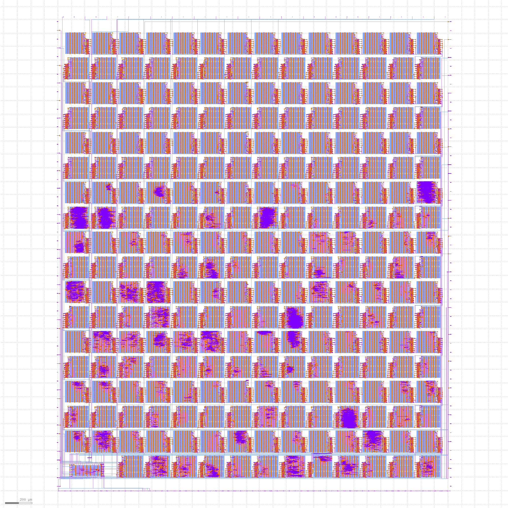

# TinyTapeout

* Visit https://tinytapeout.com for more information on the project and how to get involved.
* Read [INFO](INFO.md) for how the project is built and technical project notes.
* Read [Verification](verification.md) for how we verify the project.

# Datasheet

We are building a datasheet of all the projects.  To read it, click the tt_datasheet badge above, then download the PDF artifact.

# GDS layout of all projects

# Project Index

* [339501025136214612](https://wokwi.com/projects/339501025136214612) https://github.com/TinyTapeout/tt02-test-straight
* [340805072482992722](https://wokwi.com/projects/340805072482992722) https://github.com/TinyTapeout/tt02-test-7seg
* [341535056611770964](https://wokwi.com/projects/341535056611770964) https://github.com/TinyTapeout/tt02-test-invert
