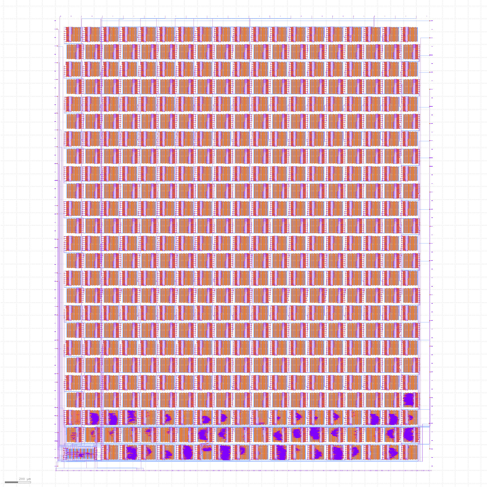

# TinyTapeout

* Visit https://tinytapeout.com for more information on the project and how to get involved.
* Read [INFO](INFO.md) for how the project is built and technical project notes.
* Read [Verification](VERIFICATION.md) for how we verify the project.

# Datasheet

[PDF Download](datasheet.pdf).

For the most recent automatic build, click the tt_datasheet badge above, then download the PDF artifact.

# GDS layout of all projects

# Project Index

